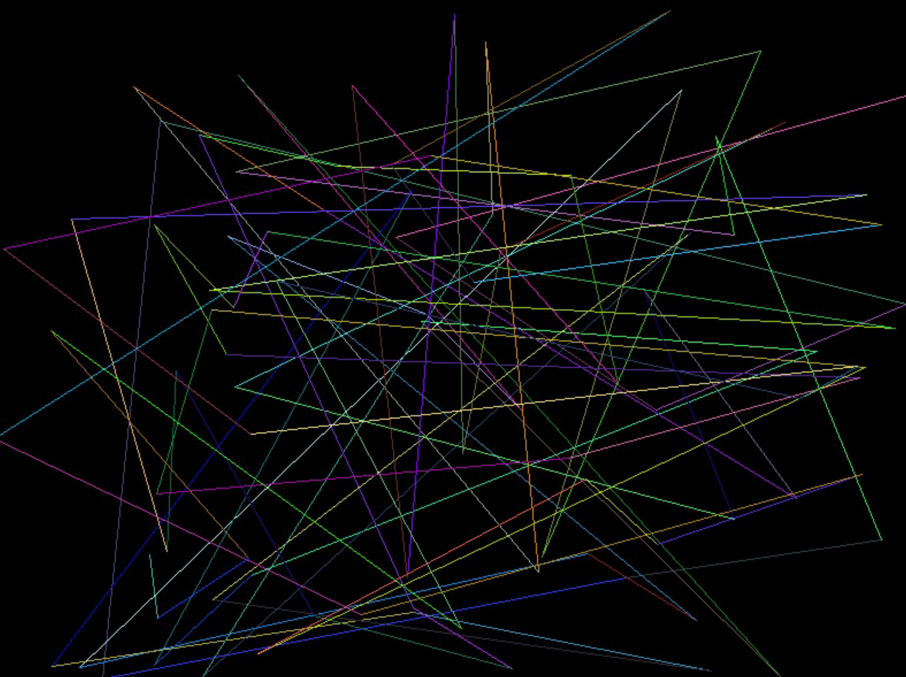
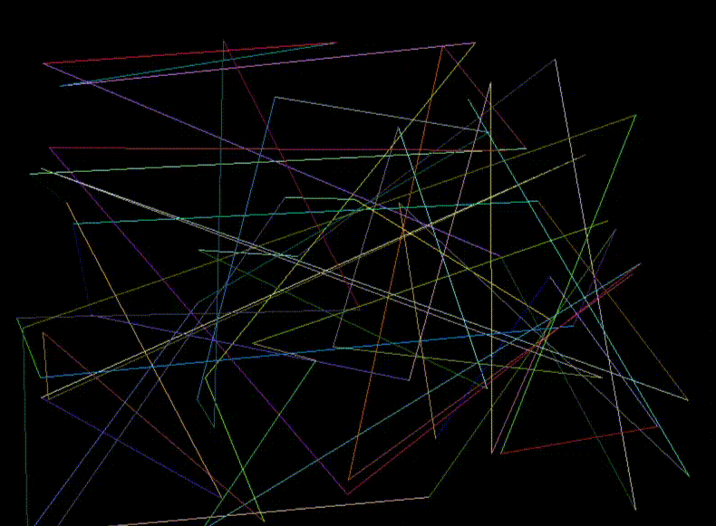

# I AM AN ARTIST, WHY DO I NEED TO KNOW HOW TO CODE??

My whole life I loved to draw but hated math and computer science. When I was applying to college, I was so happy that I won’t have any math lessons and will be working with computers only to draw digitally. It was my dream university experience, where I would do only what I like so much and don’t waste time on some “stupid calculations and coding”. **Well, I was wrong**.

During this week of Creative Computing, I wanted to dedicate my research to the **relationship between art and computers**. I explored an experiment from 2000s where fine art students were put into the circumstances where a new method of study curriculum with intensive use of computer design programs was presented to them, and they were obligated to follow it throughout the whole year. The movement toward the use of the computer as a toll in fine arts courses in colleges and universities began in earliest in the USA in the late 1980s. *Now, the role of the computer in art education has led to questioning the traditional learning of ‘basic’ skills as the technological achievement of the computer, and changing needs of employers, affect what takes place in schools, colleges, and universities in the name of art.* By the end of the experiment student gave out **positive feedback of using a computer on the daily art practice**: they produced exciting and even revolutionary art forms, their creativity and professional skills were positively affected by good software and innovative digital art tools. Nevertheless, students did not prefer to use only digital art and still wanted to use physical tools. 

Looking further into the theme of digital art, I learned about a new technological era and style: **Generative Art and Evolutionism**. William Latham was “one of the early computer artists who considered aesthetics as one of the key elements to drive our efforts in redesigning nature”. Artists of this style translated images to text, code, or binary numbers. 

ONE OF THE FIRST COILED FORMS LATHAM PRODUCED AT IBM’S UK BRANCH. 1987

A Russian design studio **ART.LEBEDEV** has developed an AI designer and, for over a year, have been passing it off as a human. To date, the network has been used successfully in over 20 of the commercial projects. By taking bold and unexpected steps, AI was able to create a genuinely new, innovative works and designs. 

EXAMPLES OF THE COMMERSIAL DESING PRODUCTS MADE BY AI

### PRINCIPLES OF THE GENERATIVE ART:
Generative art explores processes of algorithmically generating new ideas. First, you create rules that provide boundaries for the creation process; then a computer follows these rules to produce new works on your behalf. By incorporating change into a piece of code art, you get a different, unique piece of art each time you run your script, load your page, or respond to some user interactions. Through these processes artist can create innovative digital art pieces and easily share it with the online and on-site audience. Furthermore, through working with computer programs we assist technological progress in different areas of life. 

### PERSONAL EXPERIMENT:
As a part of my physical investigation, I researched some simple coding systems and was able to **generate a gif, where computer draw random lines every few seconds**. I found this process very difficult, but incredibly exciting. It was my first experiment with the generative art and I was deligted to spend many hours on it to understand how everything works and create a desired outcome.

  
   
  

### CONCLUSION:
For me it was a life-changing field of knowledge, because now I am interested in learning how to integrate my art skills on the new level of technology and create innovative art pieces. I believe that changes would always lead to a better working practice and my own development as a designer and artist. Generative art gives you a lot of areas where you can show your skills and create amazing art pieces with a number of special effects, colours and lighting, which cannot be physically obtained in real life painting, for example. Nevertheless, you still don’t lose your unique style of drawing/printing/photographing/film making, but rather integrate your practice to the mechanical processes and gain an ability to produce a larger number of art pieces or designs with the sense of randomness. Now, I know that I was wrong that I limited myself and didn’t want to learn how to code. Today, I see a great opportunity how to grow together with art and computers!

https://www.artlebedev.com/ironov/  
https://booksc.org/book/8989207/bdc372       
https://booksc.org/book/81336155/d2fbd8   
https://aiartists.org/generative-art-design    
https://en.wikipedia.org/wiki/Generative_art    
https://www.freecodecamp.org/news/an-introduction-to-generative-art-what-it-is-and-how-you-make-it-b0b363b50a70/   
https://vk.com/away.php?to=https%3A%2F%2Fwww.apress.com%2Fgp%2Fblog%2Fall-blog-posts%2Fdrawing-random-lines-in-python%2F16975626&cc_key=
